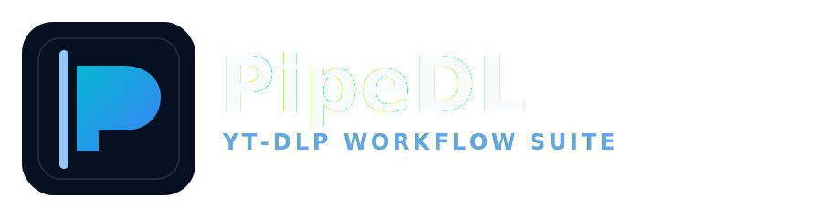

# PipeDL

<p align="left">
  
</p>


> A modern `yt-dlp` workflow with a polished web app, Brave extension, and YouTube in-page controls.

PipeDL turns common CLI download tasks into a smoother UI flow while keeping `yt-dlp` power features available.

---

## 📌 What PipeDL Does

- Download videos/audio with presets (Best / MP4 / WebM / MP3 / Opus / WAV)
- Queue multiple jobs with concurrency controls
- Pick exact stream quality (`yt-dlp -F` style selection)
- Track task history and live logs
- Start downloads from:
  - Web app
  - Extension popup
  - YouTube action-row button

---

## 🧱 Repository Layout

```text
.
├─ yt-dlp-gui/                 # Flask backend + main web UI
│  ├─ app.py
│  ├─ requirements.txt
│  └─ static/
├─ yt-dlp-brave-extension/     # Brave MV3 extension
│  ├─ manifest.json
│  ├─ popup.html
│  ├─ popup.js
│  ├─ youtube-button.js
│  ├─ options.html
│  └─ README.md
├─ docs/
│  ├─ SETUP.md
│  ├─ TROUBLESHOOTING.md
│  ├─ PUBLIC_RELEASE_CHECKLIST.md
│  └─ RELEASE_TEMPLATE.md
├─ CHANGELOG.md
└─ LICENSE
```

---

## 📥 Get the project (Git)

Clone PipeDL:

```bash
git clone https://github.com/Giggl3z/pipedl.git
cd pipedl
```

Update an existing local copy:

```bash
git pull
```

Quick pre-checks:

```powershell
python --version
git --version
```

---

## 🟢 Absolute Beginner Quick Install (copy/paste)

> If you just want it working fast, run these in PowerShell one by one.

### 1) Clone the repo

```powershell
git clone https://github.com/Giggl3z/pipedl.git
cd pipedl
```

### 2) Install dependencies

```powershell
cd yt-dlp-gui
python -m pip install --upgrade pip
python -m pip install -r requirements.txt
```

### 3) Start backend

```powershell
python app.py
```

### 4) Open app

- Go to: `http://localhost:5000`

### 5) Add extension (optional but recommended)

- Open `brave://extensions`
- Enable **Developer mode**
- Click **Load unpacked**
- Pick folder: `yt-dlp-brave-extension`

---

## ⚡ Quick Start (Recommended)

### 1) Setup once

```powershell
powershell -ExecutionPolicy Bypass -File .\setup.ps1
```

### 2) Run PipeDL

```powershell
powershell -ExecutionPolicy Bypass -File .\run.ps1
```

### 3) Use it

- Open `http://localhost:5000`
- Or open a YouTube video page and click **PipeDL** in action row

Default output folder:

- `C:\Users\<you>\Downloads\PipeDL`

---

## 🧪 Manual Start (Alternative)

```powershell
cd yt-dlp-gui; python -m pip install -r requirements.txt; python app.py
```

---

## 🧩 Brave Extension Setup

1. Open `brave://extensions`
2. Enable **Developer mode**
3. Click **Load unpacked**
4. Select folder: `yt-dlp-brave-extension/`

### Use it on YouTube

1. Open a YouTube video page (`/watch` or `/shorts`)
2. Click **PipeDL** near Like/Share
3. Choose format and start

> If button does not appear: reload extension + refresh YouTube tab.

---

## 🖥️ Web UI Guide

### Simple mode
- Fast download flow
- Minimal controls

### Pro mode
- Advanced options
- Exact quality picker
- Queue controls (stats, concurrency, cancel)

### Task system
- Statuses: `queued`, `running`, `done`, `error`, `canceled`
- Hover status chips for queue/timing details

---

## 🔌 API Endpoints

- `POST /api/download`
- `POST /api/formats`
- `GET /api/status/<task_id>`
- `GET /api/tasks`
- `POST /api/cancel/<task_id>`
- `GET/POST /api/settings`
- `POST /api/open-downloads`

---

## 📚 Documentation

- Setup → [`docs/SETUP.md`](docs/SETUP.md)
- Troubleshooting → [`docs/TROUBLESHOOTING.md`](docs/TROUBLESHOOTING.md)
- Changelog → [`CHANGELOG.md`](CHANGELOG.md)
- Release notes template → [`docs/RELEASE_TEMPLATE.md`](docs/RELEASE_TEMPLATE.md)
- Public release checklist → [`docs/PUBLIC_RELEASE_CHECKLIST.md`](docs/PUBLIC_RELEASE_CHECKLIST.md)
- Security notes → [`SECURITY.md`](SECURITY.md)

---

## ⚠️ Important Limitations

- Browser extensions cannot run `yt-dlp` directly due to sandboxing.
- The local backend (`yt-dlp-gui`) must be running for extension actions.

---

## 🤝 Contributing

- Use issue templates for bug/feature reports.
- Keep PRs focused and testable.
- Do not commit generated media or machine-specific artifacts.

---

## ⚖️ License

MIT — see [`LICENSE`](LICENSE).

## ✅ Responsible Use

Use PipeDL in compliance with platform Terms of Service and applicable laws.
