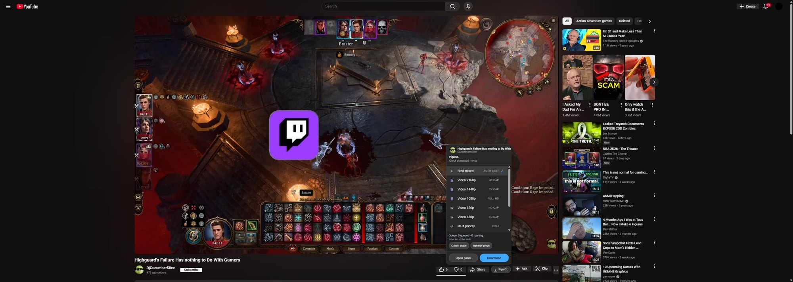
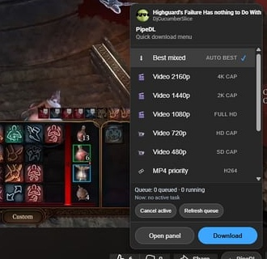
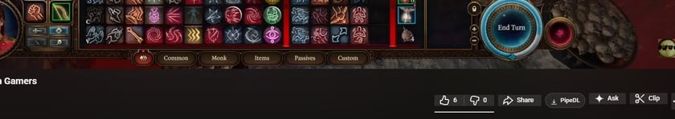

# 🧩 PipeDL Brave Extension (MV3)

> Brave extension controls for PipeDL (YouTube action button + popup workflow).

---

## ⚠️ Important

Browser extensions **cannot execute `yt-dlp` directly** (sandbox restriction).
This extension sends requests to your local PipeDL backend (default: `http://localhost:5000`).

---

## 🚀 Load in Brave

1. Open `brave://extensions`
2. Enable **Developer mode**
3. Click **Load unpacked**
4. Select folder: `yt-dlp-brave-extension`

---

## ▶️ Run backend first

```bash
cd <repo-root>/yt-dlp-gui
python app.py
```

---

## ✨ Features

- ▶️ Start download tasks
- 🎚 Format selection
- ⚙ Core toggles (subs / metadata / thumbnail / auto-open)
- 🧾 Task history + console view
- 🎨 Theme switcher
- 📂 Open downloads folder
- 🛠 Options page for backend URL
- ▶️ YouTube in-page **PipeDL** action-row button + menu

## 📸 Screenshots







---

## 🧠 Quick tip

If the YouTube button does not appear after updates:
- Reload extension in `brave://extensions`
- Refresh the YouTube tab
