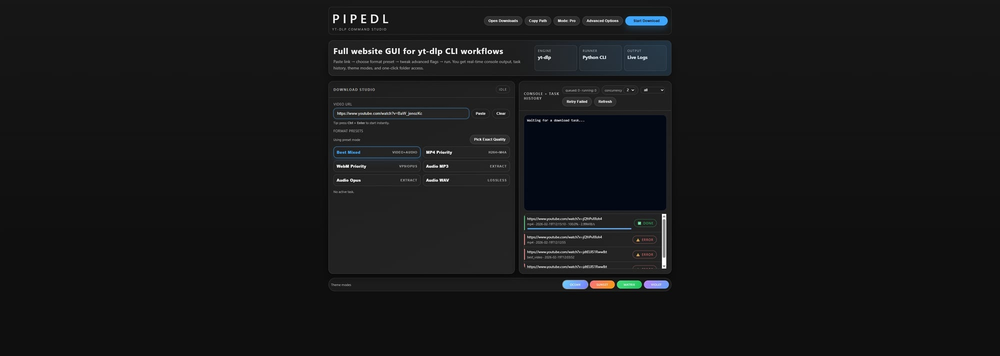
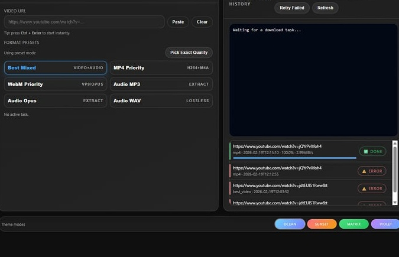
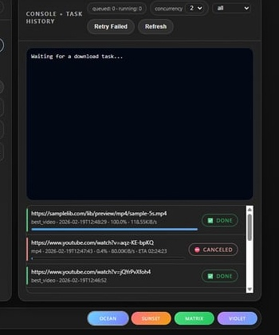

# 🖥️ PipeDL GUI

> Local web backend + modern website interface for running `yt-dlp` with a clean UX.

---

## ✨ What this module provides

- 🎬 Format presets (Best / MP4 / WebM / MP3 / Opus / WAV)
- ⚙️ Advanced flags (subs, metadata, thumbnail, retries, rate limit, output template)
- 📜 Live console output
- 🧾 Task history API
- 📂 Open downloads folder endpoint

---

## ⚡ Run (one-liner)

```powershell
python -m pip install -r requirements.txt; python app.py
```

Open: `http://localhost:5000`

---

## 📸 Screenshots







---

## 🔌 API Endpoints

- `POST /api/download`
- `GET /api/status/<task_id>`
- `GET /api/tasks`
- `POST /api/open-downloads`

---

## 📂 Output Path

`C:\Users\<you>\Downloads\PipeDL`

---

## 🛠 Notes

- Uses `python -m yt_dlp` internally
- Keep this backend running while using the Brave extension
